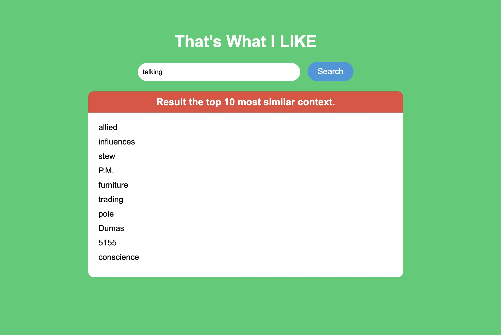

# A1-That-s-What-I-LIKE 
## st124738
## Sonakul kamnuanchai
## Objective
Find the top 10 most similar context using natural language processing. 

## Citation data source
- NLTK Datasets using brown corpus : https://www.nltk.org/
- For model comparison Syntactic and Semantic Accuracy : https://www.fit.vut.cz/person/imikolov/public/rnnlm/word-test.v1.txt
- For model comparison correlation scores (wordsim_similarity_goldstandard.txt) : http://alfonseca.org/eng/research/wordsim353.html 

## Model Comparison and Analysis

| Model             | Window Size | Training Loss | Training Time | Syntactic Accuracy | Semantic Accuracy |
|-------------------|-------------|---------------|---------------|--------------------|-------------------|
| Skipgram          | 2     | 9.538479       | 6m 11s      | 0.00%            | 0.00%           |
| Skipgram (NEG)    | 2     | 8.325145       | 6m 11s       | 0.00%            | 0.00%           |
| Glove             | 2     | 0.706326       | 1m 20s      | 0.00%            | 0.00%           |
| Glove (Gensim)    | -     | -       | -       | 55.45%            | 93.87%           |

## Correlation Scores

| Model               | Skipgram | Skipgram (NEG) | GloVe | GloVe (Gensim) |
|---------------------|-----------|----------------|-------|----------------|
| MSE            | -0.1328   | 0.1604        | 0.0726 | 0.6019       |

This assignments, I will select skipgram with negative sampling because it have highest correlation scores with 0.1604 and i ignore pretrained model (Glove(Gensim)).

## How to run the application:
python app.py

## Screenshot demo web application
